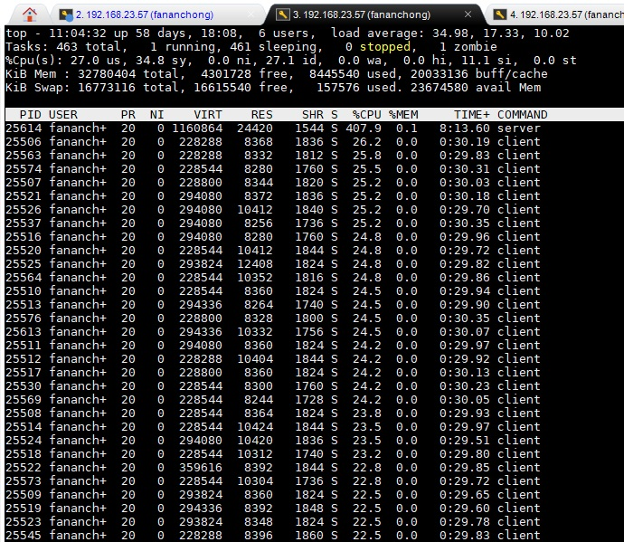

# gotcp

一个GO语言TCP网络库

## 服务器例子

1. 组合嵌入gotcp.Session，制作自己的TCP网络会话

    例如：

    ```go
    type Echo struct {
      gotcp.Session
    }

    func (this *Echo) OnRecv(data []byte, flag byte) {
      if this.IsVerified() == false {
        // ...(业务代码，略)...
        this.Verify()
      }
      // ...(业务代码，略)...
    }

    func (this *Echo) OnClose() {
      // ...(业务代码，略)...
    }
    ```

2. 注册网络会话类，开启服务

    例如：

    ```go
    s := &gotcp.Server{}
    s.RegisterSessType(Echo{})
    s.Start(":3000")
    ```

## 客户端例子

1. 组合嵌入gotcp.Session，制作自己的TCP网络会话

    例如：

    ```go
    type Echo struct {
      gotcp.Session
    }

    func (this *Echo) OnRecv(data []byte, flag byte) {
      if this.IsVerified() == false {
        // ...(业务代码，略)...
        this.Verify()
      }
      // ...(业务代码，略)...
    }

    func (this *Echo) OnClose() {
      // ...(业务代码，略)...
    }
    ```

2. 连接服务器

    例如：

    ```go
    echo := &Echo{}
    echo.Connect("localhost:3000", echo)
    ```

## 参考项目

参考了以下开源库：

- <https://github.com/cpp2go/gonet>


## 基准测试

- 测试代码：
	- [example/server/server.go](example/server/server.go)
	- [example/client/client.go](example/client/client.go)

- 机器配置： CPU 16核 ； 主频 2600
- 进程数： 1 服务器 ； 30 客户端
- 启动脚本： [test.sh](test.sh)
- 整机 CPU 70%
- 服务器程序 CPU 占 25.5% （  407.9 / 1600  ）
- 23w qps




## 更多的测试

懒得在主页上写了，请参考： https://blog.csdn.net/u013272009/article/details/96873908
